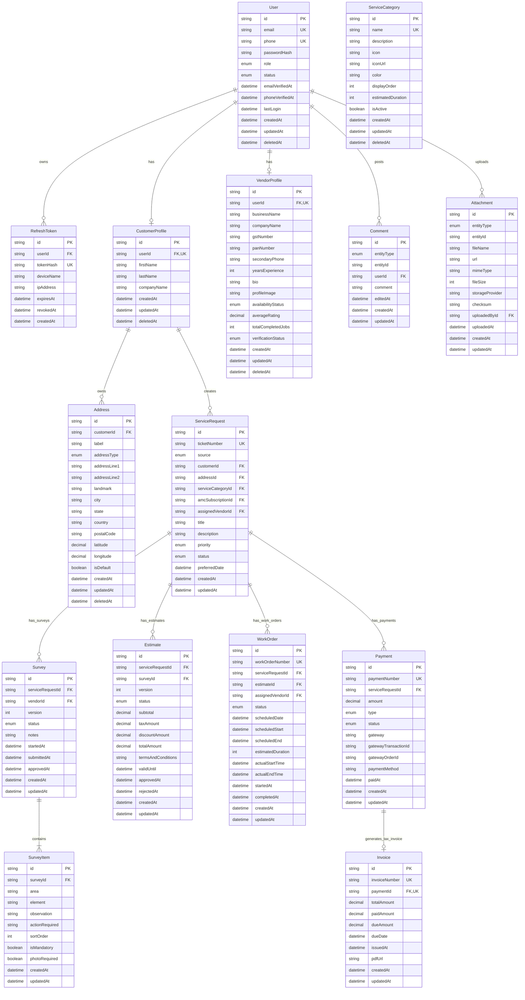

# Entity-Relationship (ER) Diagram (Final Frozen Architecture)

```mermaid
erDiagram

    User {
        string id PK
        string email UK
        string phone UK
        string passwordHash
        enum role
        enum status
        datetime emailVerifiedAt
        datetime phoneVerifiedAt
        datetime lastLogin
        datetime createdAt
        datetime updatedAt
        datetime deletedAt
    }

    RefreshToken {
        string id PK
        string userId FK
        string tokenHash UK
        string deviceName
        string ipAddress
        datetime expiresAt
        datetime revokedAt
        datetime createdAt
    }

    CustomerProfile {
        string id PK
        string userId FK, UK
        string firstName
        string lastName
        string companyName
        datetime createdAt
        datetime updatedAt
        datetime deletedAt
    }

    VendorProfile {
        string id PK
        string userId FK, UK
        string businessName
        string companyName
        string gstNumber
        string panNumber
        string secondaryPhone
        int yearsExperience
        string bio
        string profileImage
        enum availabilityStatus
        decimal averageRating
        int totalCompletedJobs
        enum verificationStatus
        datetime createdAt
        datetime updatedAt
        datetime deletedAt
    }

    Address {
        string id PK
        string customerId FK
        string label
        enum addressType
        string addressLine1
        string addressLine2
        string landmark
        string city
        string state
        string country
        string postalCode
        decimal latitude
        decimal longitude
        boolean isDefault
        datetime createdAt
        datetime updatedAt
        datetime deletedAt
    }

    ServiceCategory {
        string id PK
        string name UK
        string description
        string icon
        string iconUrl
        string color
        int displayOrder
        int estimatedDuration
        boolean isActive
        datetime createdAt
        datetime updatedAt
        datetime deletedAt
    }

    ServiceRequest {
        string id PK
        string ticketNumber UK
        enum source
        string customerId FK
        string addressId FK
        string serviceCategoryId FK
        string amcSubscriptionId FK
        string assignedVendorId FK
        string title
        string description
        enum priority
        enum status
        datetime preferredDate
        datetime createdAt
        datetime updatedAt
    }

    Survey {
        string id PK
        string serviceRequestId FK
        string vendorId FK
        int version
        enum status
        string notes
        datetime startedAt
        datetime submittedAt
        datetime approvedAt
        datetime createdAt
        datetime updatedAt
    }

    SurveyItem {
        string id PK
        string surveyId FK
        string area
        string element
        string observation
        string actionRequired
        int sortOrder
        boolean isMandatory
        boolean photoRequired
        datetime createdAt
        datetime updatedAt
    }

    Estimate {
        string id PK
        string serviceRequestId FK
        string surveyId FK
        int version
        enum status
        decimal subtotal
        decimal taxAmount
        decimal discountAmount
        decimal totalAmount
        string termsAndConditions
        datetime validUntil
        datetime approvedAt
        datetime rejectedAt
        datetime createdAt
        datetime updatedAt
    }

    WorkOrder {
        string id PK
        string workOrderNumber UK
        string serviceRequestId FK
        string estimateId FK
        string assignedVendorId FK
        enum status
        datetime scheduledDate
        datetime scheduledStart
        datetime scheduledEnd
        int estimatedDuration
        datetime actualStartTime
        datetime actualEndTime
        datetime startedAt
        datetime completedAt
        datetime createdAt
        datetime updatedAt
    }

    Payment {
        string id PK
        string paymentNumber UK
        string serviceRequestId FK
        decimal amount
        enum type
        enum status
        string gateway
        string gatewayTransactionId
        string gatewayOrderId
        string paymentMethod
        datetime paidAt
        datetime createdAt
        datetime updatedAt
    }

    Invoice {
        string id PK
        string invoiceNumber UK
        string paymentId FK, UK
        decimal totalAmount
        decimal paidAmount
        decimal dueAmount
        datetime dueDate
        datetime issuedAt
        string pdfUrl
        datetime createdAt
        datetime updatedAt
    }

    Comment {
        string id PK
        enum entityType
        string entityId
        string userId FK
        string comment
        datetime editedAt
        datetime createdAt
        datetime updatedAt
    }

    Attachment {
        string id PK
        enum entityType
        string entityId
        string fileName
        string url
        string mimeType
        int fileSize
        string storageProvider
        string checksum
        string uploadedById FK
        datetime uploadedAt
        datetime createdAt
        datetime updatedAt
    }

    User ||--o| CustomerProfile : "has"
    User ||--o| VendorProfile : "has"
    User ||--o{ RefreshToken : "owns"
    CustomerProfile ||--o{ Address : "owns"
    CustomerProfile ||--o{ ServiceRequest : "creates"
    ServiceRequest ||--o{ Survey : "has_surveys"
    ServiceRequest ||--o{ Estimate : "has_estimates"
    ServiceRequest ||--o{ WorkOrder : "has_work_orders"
    ServiceRequest ||--o{ Payment : "has_payments"
    Payment ||--o| Invoice : "generates_tax_invoice"
    Survey ||--|{ SurveyItem : "contains"
    User ||--o{ Comment : "posts"
    User ||--o{ Attachment : "uploads"
```
